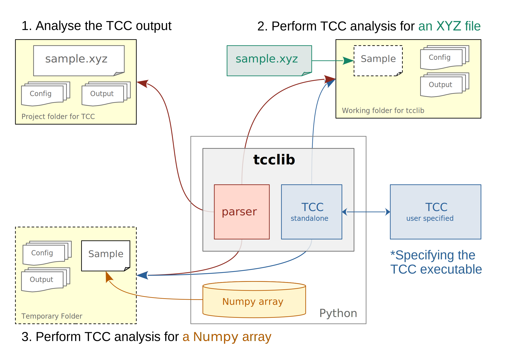

# Topological Cluster Classification in Python


## Introduction

This package aims to provide a stand-alone Python interface for the [TCC](https://github.com/royallgroup/TCC) software.

- This package calles the `TCC` binary executable in Python.
- When installing `tcclib`, the latest release of `TCC` code will be compiled, generating a privite binary executable for `tcclib`
- If you have your own `TCC` binary executable in the computer, it will **not** be affected.

## Install

You can clone the repository from GitHub and install, with the following command.

```sh
git clone --recurse-submodules https://github.com/yangyushi/tcclib
cd tcclib
python3 -m pip install . --user
```

You will need a C compiler (like GCC) and CMake to build tcc. `tcclib` also depends on numpy and pandas.

## Typical Tasks

The following figure illustrates the typical tasks for `tcclib`.

1. Analysing an existing TCC output folder. ([Example](examples/task-1))
2. Calling TCC to analyse an XYZ file (on the disk), then analysing the output. ([Example](examples/task-2))
3. Calling TCC to analyse a numpy array (in the memory), then analysing the output. ([Example](examples/task-3))



## Quick Start

### Static Analysis

The standard way to use `TCC` is to analying configurations stored in an XYZ file. In `tcclib` the task can be carried out using the following code.

```python
import tcc

# Specifying the output folder of TCC to be TCC-RESULT
parser = tcc.Parser('TCC-RESULT')

# [optional] Calling the TCC to analyse the xyz file.
parser.clusters_to_analyse = ['sp5c', '8A']
parser.run("DATA.xyz", box=[10, 10, 10], raw=True, clusts=True)

# Parsing the output files generated by TCC
parser.parse()

# Typical Results
parser.population    # populations clusters in different frames
parser.frame_bool(0)  # For frame 0, if particle is inside a cluster
parser.frame_count(1)  # For frame 1, count the number of clusters a particle belongs to
```

The result of the static analysis will be stored in `TCC-RESULT` folder, and it can be re-analysed without calling `tcc.run`.

### Volatile Analysis (On the Fly)

`tcclib` also offered a way to analyse coordinates sotred as numpy array, getting the result, and then delete the output on the harddrive.

```python
# Specifying the output folder of TCC to be TCC-RESULT
otf = tcclib.OTF()

# generate 10 frames of random points with different particle numbers
coordinates = [np.random.random((500 + i, 3)) * 10 for i in range(10)]

# Calling the TCC to analyse the xyz file, analysing all clusters
otf.run(coordinates, box=[10, 10, 10], raw=True, clusts=True)

# Typical Results
otf.population    # populations clusters in different frames
otf.frame_bool(0)  # For frame 0, if particle is inside a cluster
otf.frame_count(1)  # For frame 1, count the number of clusters a particle belongs to
```

The results were sotred inside a temporary folder, and will be deleted uplon the finish of the Python interpreter.

### Setting Parameters

For all the [input parameters for tcc](https://royallgroup.github.io/TCC/html/tcc_input_parameters.html), they can be set in the `Parser.run` or `OTF` calls. Here are some examples,

```python
# set tcc parameters for parser
parser = tcc.Parser('TCC-RESULT')
parser.run(
  "DATA.xyz",  # xyz filename, required
  box,         # bounding box, required
  # these parameters were optional. If not specified, default values will be used.
  raw=True, clusts=True, rcutAA=10, cell_list=0, PBCs=0
)

# set tcc parameters for on-the-fly calculation
otf = tcclib.OTF()
otf(
  coordinates,  # a list of numpy arrays, required
  box,          # the bounding box, required
  # these parameters were optional. If not specified, default values will be used.
  raw=True, clusts=True, rcutAA=10, cell_list=0, PBCs=0
)
```
