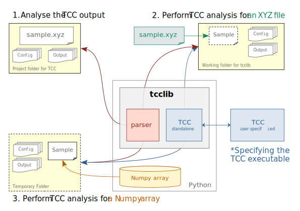

# Topological Cluster Classification in Python


## Install

You can clone the repository from GitHub and install, with the following command.

```sh
git clone --recurse-submodules https://github.com/yangyushi/tcclib
cd tcclib
python3 -m pip install . --user
```

You will need a C compiler (like GCC) and CMake to build tcc. `tcclib` also depends on numpy and pandas.

## Typical Tasks

This package aims to provide a stand-alone Python interface for the [TCC](https://github.com/royallgroup/TCC) software.

The following figure illustrates the typical tasks for `tcclib`.

1. Analysing an existing TCC output folder. ([Example](examples/task-1))
2. Calling TCC to analyse an XYZ file (on the disk), then analysing the output. ([Example](examples/task-2))
3. Calling TCC to analyse a numpy array (in the memory), then analysing the output. ([Example](examples/task-3))



## Details

- This package calles the `TCC` binary executable inside Python.
- When installing `tcclib`, the latest release of `TCC` code will be compiled, generating a privite binary executable for `tcclib`
- If you have your own `TCC` binary executable in the computer, it will **not** be affected.
